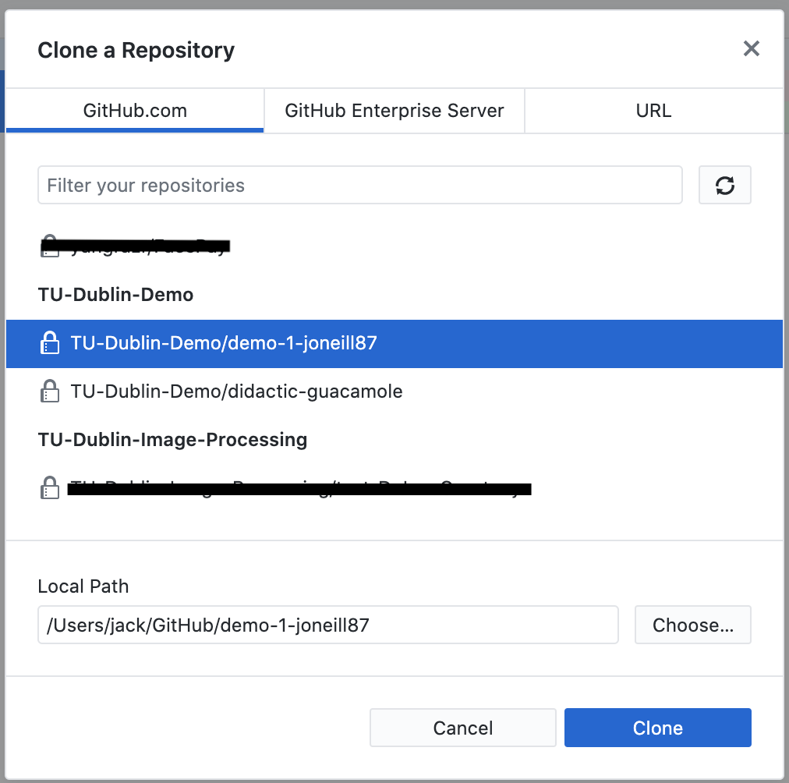
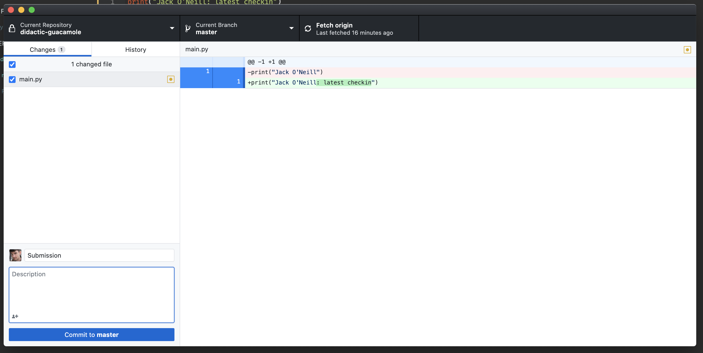
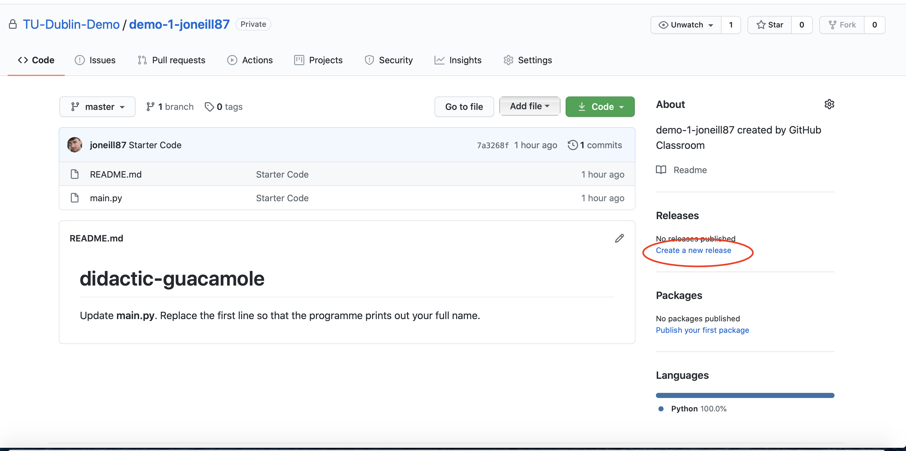
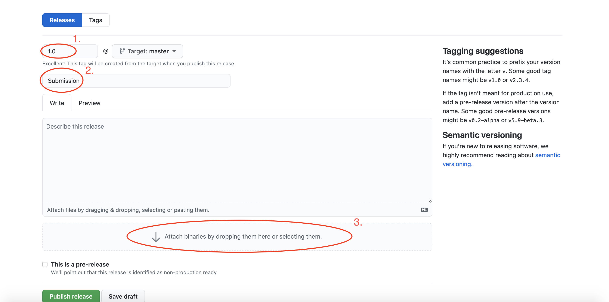

# GitHub Classroom

Assignment submissions are handled through GitHub classroom. If you don't have one already you can sign up for a free account. I suggest using a personal email as your primary GitHub login so you can retain access after your university email account expires. GitHub also provides a bundle of free software and services for full-time students, so even if you already have an account be sure to check out [https://education.github.com/pack](https://education.github.com/pack).

## Accepting Assignments
Assignments will be visible in Brightspace *Assessment -> Assignments*. The assignment description will include an invitation link to GitHub classroom. When you click this link you may be asked to sign into GitHub. The first time you accept an assignment you will be asked to link your GitHub account to a student record. Please add this in the format \<*First Name*\> \<*Last Name*\> \<*Student Number*\>. Once accepted GitHub will copy the starter code into your own private repository.

## Downloading the Repository
For those of you familiar with Git, you can download the repository using the standard command-line tools. However, you may find it easier and a little more intuitive to use the GitHub desktop client to manage your repositories. You can download the latest GitHub desktop client from [https://desktop.github.com](https://desktop.github.com). To copy the files from your repository to your computer open the desktop client, sign in to your GitHub account and go to *File* -> *Clone Repository*, choose your repository from the list and click *Clone*. Once the repository is open in your desktop client you can choose to Open in File Explorer / Finder to open the folder on your computer.

## Working on the Assignment
As you make changes to the assignment files they will be tracked by GitHub. When you're finished, open the Desktop Client, and ensure all of the files in the left-hand pane are checked, then add a description to the Summary (something like **Submission** is fine). Click on the *Commit to Master* button to finalise your changes.

## Marking the Assignment Complete
GitHub classroom uses *releases* to mark assignments complete. In order to create a release you will need to open the repository **in your web browser** (this functionality is not available from the desktop client). From the repository home page navigate to *releases*.

From the Releases page you will need to set a few configuration options. First, give the release a version number (we'll follow industry standard and use *1.0* to indicate a finished product) see **1.** below.

Next, give the release a description (**2.**) The word *submission* will suffice. Finally, add any file outputs to the release by dragging them into the *attach binaries* dropzone (**3.**). Finally, click on Publish Release 
to complete the submission

## Submitting through Brightspace ##
Finally, you'll need to head over to Brightspace to submit your assignment. This is **extremely important** as otherwise your assignment may not be corrected. Open the assignment in Brightspace, zip up the folder containing your code and attach it to your submission. Your submission description should also contain a link to your GitHub repository. Feedback and results will be provided through the Brightspace submission.
